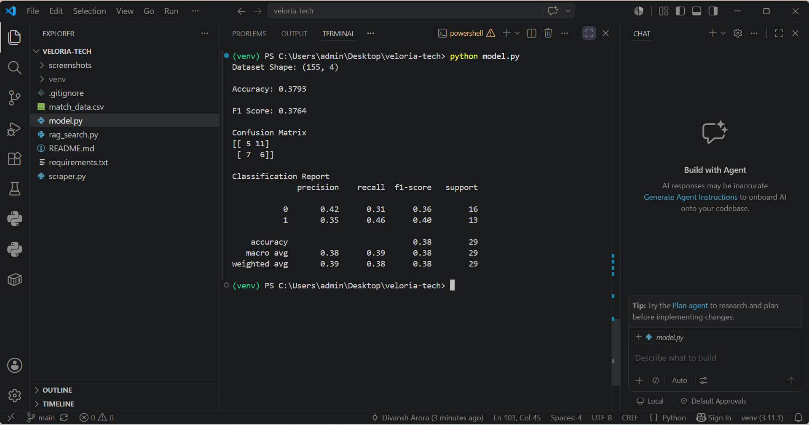

# Veloria Tech ML Internship Assignment

## Overview

This project was completed as part of the AI/ML Engineering Internship assignment for Veloria Tech.

The assignment consists of:

1. Data Collection using Web Scraping
2. Machine Learning Prediction Model
3. Semantic Search using Vector Embeddings (Bonus)

---

## Project Structure

```text
veloria-tech-ml-intern-assignment/
│
├── scraper.py
├── match_data.csv
├── model.py
├── rag_search.py
├── requirements.txt
└── README.md
```

---

## Task 1: Data Collection

### Objective

Collect cricket match information for India vs Australia ODI matches from HowStat.

### Data Collected

* Match Date
* Series
* Venue
* Match Result

### Output

Data is stored in:

```text
match_data.csv
```

### Technologies Used

* Python
* BeautifulSoup
* Pandas

### Dataset Size

* 155 ODI matches between India and Australia

---

## Task 2: Machine Learning Prediction Model

### Objective

Build a machine learning model to predict match outcomes.

### Data Preparation

* Removed missing values
* Extracted winner information from match results
* Encoded categorical variables using LabelEncoder

### Features Used

* Team 1
* Team 2
* Venue

### Algorithm Used

Random Forest Classifier

### Why Random Forest?

Random Forest is easy to implement, handles categorical data effectively, reduces overfitting compared to a single decision tree, and performs well on structured datasets.

### Results

Accuracy: 37.93%

F1 Score: 37.64%

Confusion Matrix:

```text
[[5 11]
 [7 6]]
```

### Observation

Since the dataset contains only India vs Australia matches, team-related features remain constant. Venue becomes the primary predictive feature, which limits predictive performance. A larger multi-team dataset would likely improve accuracy.

---

## Task 3: Semantic Search Using Vector Embeddings

### Objective

Implement a simple Retrieval-Augmented Retrieval system using sentence embeddings.

### Approach

1. Convert each match record into a text document.
2. Generate embeddings using Sentence Transformers.
3. Store embeddings in memory.
4. Perform semantic similarity search using cosine similarity.
5. Return the most relevant matches for a user query.

### Model Used

```text
all-MiniLM-L6-v2
```

### Example Queries

```text
matches played in sydney

india victories in world cup

australia won by large margin
```

---

## Installation

Create and activate a virtual environment:

```bash
python -m venv venv

# Windows PowerShell
.\venv\Scripts\Activate.ps1
```

Install dependencies:

```bash
pip install -r requirements.txt
```

---

## Running the Project

### Run Scraper

```bash
python scraper.py
```

### Run Machine Learning Model

```bash
python model.py
```

### Run Semantic Search

```bash
python rag_search.py
```

---

## Libraries Used

* pandas
* beautifulsoup4
* requests
* scikit-learn
* sentence-transformers
* numpy

---

## Challenges Faced

* HowStat blocks automated requests with HTTP 403 responses.
* The website data was therefore processed from a locally saved HTML page.
* The dataset contained only India vs Australia matches, limiting feature diversity for machine learning.

---

## Model Output



## Semantic Search Output


---

## Author

Divansh Arora
